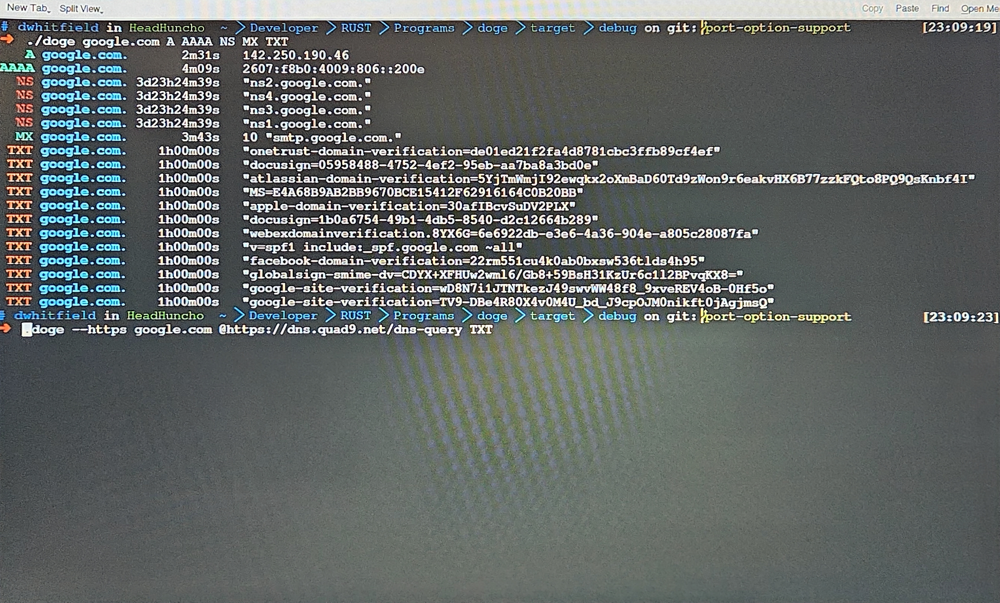

<h1>doge</h1>

doge is a fork of [dog](https://github.com/ogham/dog).

<!--  -->

---

Doge _can_ look up!

**doge** is a command-line DNS client, like `dig` forked from the amazing work done [here](https://github.com/ogham/dog).
It has colourful output, understands normal command-line argument syntax, supports the DNS-over-TLS and DNS-over-HTTPS protocols, and can emit JSON. I belive this is an amazing project and should be improved on.

## Examples

    doge example.net                          Query a domain using default settings
    doge example.net MX                       ...looking up MX records instead
    doge example.net MX @1.1.1.1              ...using a specific nameserver instead
    doge example.net MX @1.1.1.1 -T           ...using TCP rather than UDP
    doge exapple.net MX @1.1.1.1 -p 53        ...using a nonstandart port
    doge -q example.net -t MX -n 1.1.1.1 -T   As above, but using explicit arguments

---

## Command-line options

### Query options

    <arguments>              Human-readable host names, nameservers, types, or classes
    -q, --query=HOST         Host name or domain name to query
    -t, --type=TYPE          Type of the DNS record being queried (A, MX, NS...)
    -n, --nameserver=ADDR    Address of the nameserver to send packets to
    -p, --port=PORT            Port options for sending queries on nonstandart ports
    --class=CLASS            Network class of the DNS record being queried (IN, CH, HS)

### Sending options

    --edns=SETTING           Whether to OPT in to EDNS (disable, hide, show)
    --txid=NUMBER            Set the transaction ID to a specific value
    -Z=TWEAKS                Set uncommon protocol-level tweaks

### Protocol options

    -U, --udp                Use the DNS protocol over UDP
    -T, --tcp                Use the DNS protocol over TCP
    -S, --tls                Use the DNS-over-TLS protocol
    -H, --https              Use the DNS-over-HTTPS protocol

### Output options

    -1, --short              Short mode: display nothing but the first result
    -J, --json               Display the output as JSON
    --color, --colour=WHEN   When to colourise the output (always, automatic, never)
    --seconds                Do not format durations, display them as seconds
    --time                   Print how long the response took to arrive

---

## Installation

Currently:
    To install dog, you can download a pre-compiled binary, or you can compile it from source. You _**may**_ be able to install dog using your OS’s package manager, depending on your platform.

Issues: 
    I am not a rust expert at all, Honestly I'm the opposite, just learning codding. I used [`dog`](https://github.com/ogham/dog) on my arch system and a few random *nix Laptops that I perpetually fix and break . As such part of this progect will be outside of my skill set or ability to work on currently. 
    For **Windows** I don't intende on installing windows 11 anytime soon, So I most likely won't be adding new windows features
    For **Macos** Till i can afford to waste money on a mac, the workflow for building release packages is the only support macos is going to get
    For **Docker**, This is magic as far as I'm concerned. While I learn the spells to use it in a meaningful way expect things to be broken 
    
    If any of these are things you want to see make a PR and I'll read and merge it, Be on the lookout for some potentially dumb questions from me.

### Packages

    They exist now !!!

    $ cargo install dns-doge
    $ yay -S dns-doge
    
<!-- - For Homebrew on macOS, install the [`dog`](https://formulae.brew.sh/formula/dog) formula.
- For NixOS, install the [`dogdns`](https://search.nixos.org/packages?channel=unstable&show=dogdns&query=dogdns) package. -->

### Downloads

Binary downloads of doge are available from [the releases section on GitHub](https://github.com/Dj-Codeman/doge/releases/) for 64-bit Windows, macOS, and Linux targets. They contain the compiled executable, the manual page, and shell completions.

### Compilation

doge is written in [Rust](https://www.rust-lang.org).
I working on rustc version [1.76.0](https://blog.rust-lang.org/2024/02/08/Rust-1.76.0.html) you should be running this version or newer.
The recommended way to install Rust for development is from the [official download page](https://www.rust-lang.org/tools/install), using rustup.

To build, download the source code and run:

    $ cargo build
    $ cargo test

- If you are compiling a copy for yourself, be sure to run `cargo build --release` or `make build-release` to benefit from release-mode optimisations.
Copy the resulting binary, which will be in the `target/release` directory, into a folder in your `$PATH`.
`/usr/local/bin` is usually a good choice.

- To compile and install the manual pages, you will need [pandoc](https://pandoc.org/).
The `make man` command will compile the Markdown into manual pages, which it will place in the `target/man` directory.
To use them, copy them into a directory that `man` will read.
`/usr/local/share/man` is usually a good choice.

### ~~Container image~~
#### These may still work but they will be ***unstable*** as I might break them.

To build the container image of doge, you can use Docker or Kaniko. Here an example using Docker:

    $ docker build -t doge .

You can then run it using the following command:

    $ docker run -it --rm doge

To run dog directly, you can then define the following alias:

    $ alias doge="docker run -it --rm doge"

### Feature toggles

doge has three Cargo features that can be switched off to remove functionality.
While doing so makes doge less useful, it results in a smaller binary that takes less time to build.

There are three feature toggles available, all of which are active by default:

- `with_idna`, which enables [IDNA](https://en.wikipedia.org/wiki/Internationalized_domain_name) processing
- `with_tls`, which enables DNS-over-TLS
- `with_https`, which enables DNS-over-HTTPS (requires `with_tls`)

Use `cargo` to build a binary that uses feature toggles. For example, to disable TLS and HTTPS support but keep IDNA support enabled, you can run:

    $ cargo build --no-default-features --features=with_idna

The list of features that have been disabled can be checked at runtime as part of the `--version` string.

---

## Documentation

For documentation on how to use doge, see the dog website: <https://dns.lookup.dog/>
Eventually I will make a new one

## Licence

doge’s source code is licenced under the [MIT](https://choosealicense.com/licenses/mit/).
If this is wrong please email me at dwhitfield@ramfield.net
